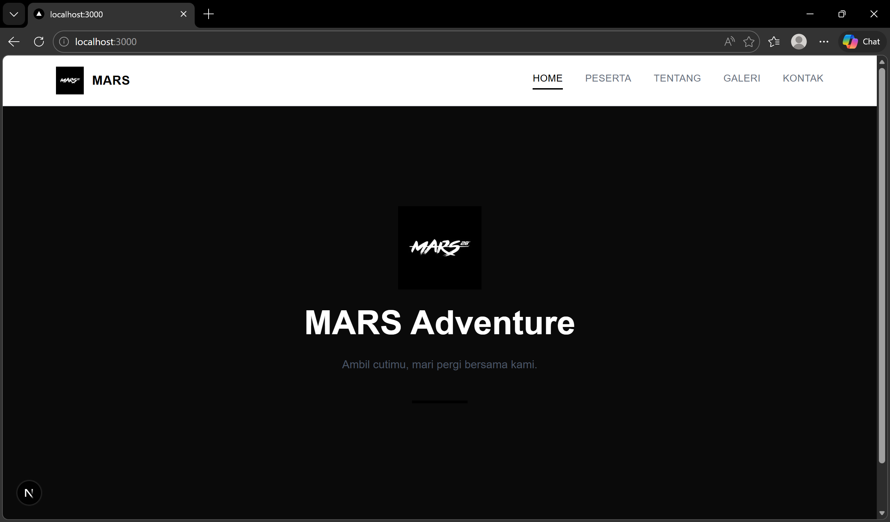
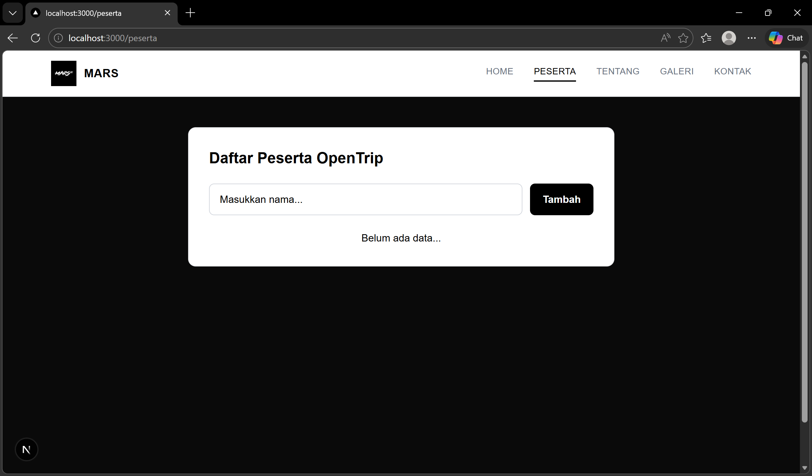
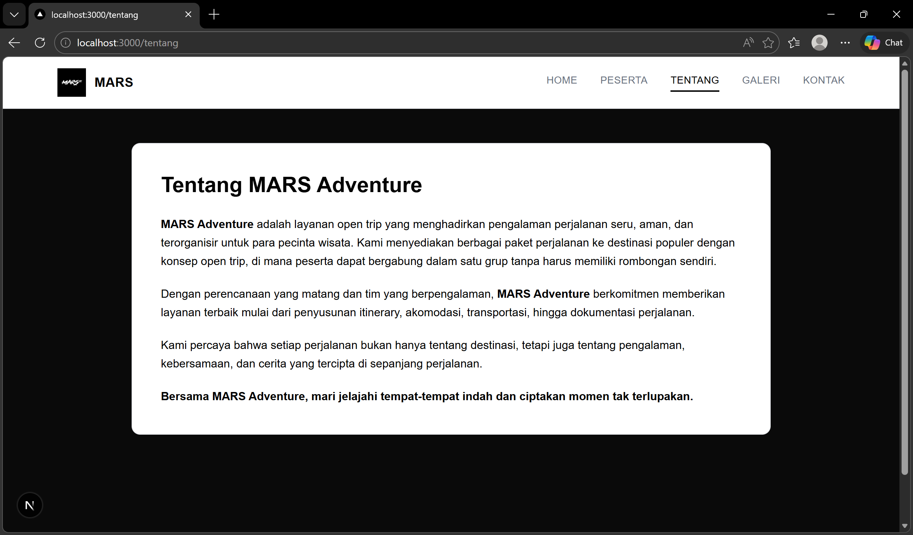
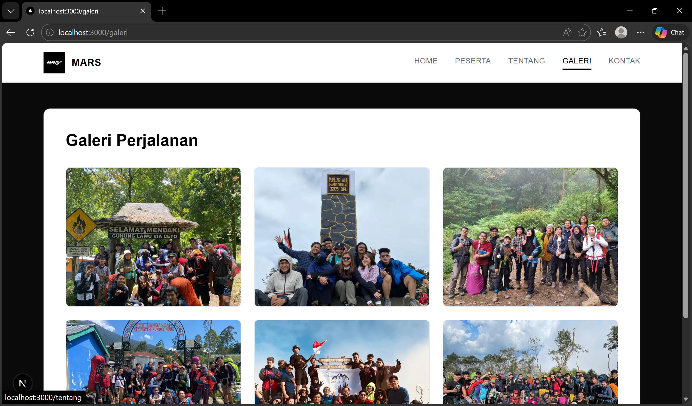
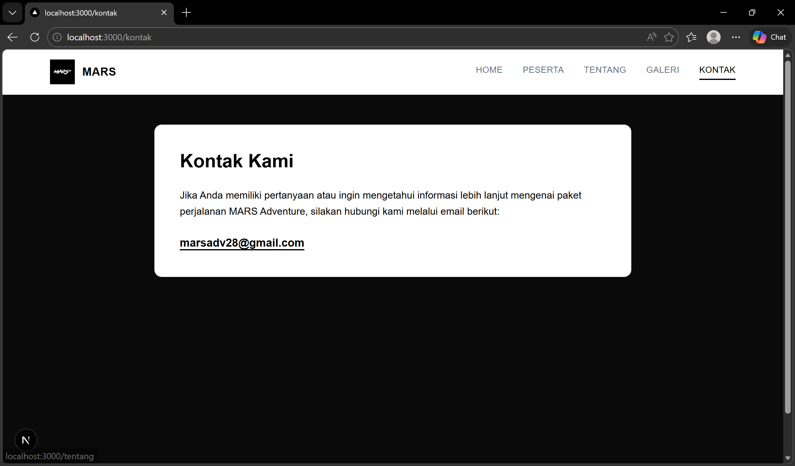

## Hasil Tampilan
Berikut adalah hasil implementasi soal 1:

Program ini merupakan aplikasi Form CRUD sederhana menggunakan Next.js dengan TypeScript. Aplikasi berjalan di sisi client dengan menambahkan `"use client"` dan menggunakan React Hook `useState` untuk mengelola data.

Fitur yang tersedia meliputi:

1. Tambah data (Create)
   User memasukkan nama ke dalam input, lalu saat form disubmit, data akan ditambahkan ke dalam state `data` dan ditampilkan dalam daftar.

2. Tampilkan data (Read)
   Data yang tersimpan dalam state ditampilkan menggunakan metode `map()` sehingga setiap perubahan state langsung memperbarui tampilan.

3. Edit data (Update)
   Ketika tombol Edit ditekan, data yang dipilih dimasukkan kembali ke input dan index-nya disimpan dalam `editIndex`. Setelah disubmit, data lama akan diperbarui.

4. Hapus data (Delete)
   Tombol Hapus akan menghapus data berdasarkan index menggunakan method `filter()`, kemudian state diperbarui sehingga tampilan berubah secara otomatis.

Secara keseluruhan, program ini menerapkan konsep state management, event handling (`onChange`, `onSubmit`, `onClick`), conditional rendering, dan rendering list dinamis dalam Next.js.

## Hasil Tampilan
Berikut adalah hasil implementasi soal 2:

Berikut adalah penjelasan dari website yang telah dibuat:

1. Struktur Website
   Website dibuat menggunakan Next.js dengan App Router. Terdapat lima halaman utama, yaitu Home, Peserta, Tentang, Galeri, dan Kontak. Navigasi antar halaman menggunakan komponen Link sehingga perpindahan halaman berjalan tanpa reload penuh.

2. Navbar (Menu Navigasi)
   Navbar dibuat sebagai komponen terpisah agar dapat digunakan di semua halaman melalui layout. Navbar berisi logo gambar, nama OPENTRIP, serta lima menu navigasi. Menu yang sedang aktif akan ditandai secara otomatis. Desain menggunakan tema putih, hitam, dan abu-abu agar terlihat profesional dan minimalis.

3. Halaman Home
   Halaman Home berfungsi sebagai halaman utama yang menampilkan logo, judul OpenTrip Management, serta deskripsi singkat mengenai sistem. Tampilan dibuat sederhana dan bersih untuk memberikan kesan modern dan rapi.

4. Halaman Peserta
   Halaman ini merupakan bagian interaktif dari website. Di dalamnya terdapat form untuk menambahkan nama peserta open trip. Fitur yang tersedia meliputi:

* Menambahkan data peserta
* Mengedit data peserta
* Menghapus data peserta
* Menampilkan pesan jika belum ada data

Fitur ini dibuat menggunakan useState untuk mengelola state, serta event handler seperti onSubmit dan onClick untuk menangani interaksi pengguna. Data disimpan dalam array dan dimanipulasi menggunakan spread operator dan filter.

5. Halaman Tentang
   Halaman ini berisi penjelasan mengenai MARS Adventure sebagai layanan open trip. Isi halaman menjelaskan konsep open trip, komitmen pelayanan, serta tujuan menghadirkan pengalaman perjalanan yang berkesan. Konten ditampilkan dalam bentuk card dengan tata letak yang rapi.

6. Halaman Galeri
   Halaman Galeri menampilkan foto-foto perjalanan dalam bentuk grid yang responsif. Layout menyesuaikan ukuran layar, sehingga tetap rapi di perangkat mobile maupun desktop. Gambar menggunakan komponen next/image agar lebih optimal.

7. Halaman Kontak
   Halaman Kontak berisi informasi email resmi, yaitu [marsadv28@gmail.com](mailto:marsadv28@gmail.com). Email dapat diklik dan akan langsung membuka aplikasi email pengguna melalui fitur mailto.

8. Konsep Desain
   Website menggunakan tema dasar putih dengan aksen hitam dan abu-abu. Desain dibuat minimalis dengan border tipis, shadow halus, dan sudut membulat. Konsep ini memberikan kesan profesional, bersih, dan modern.