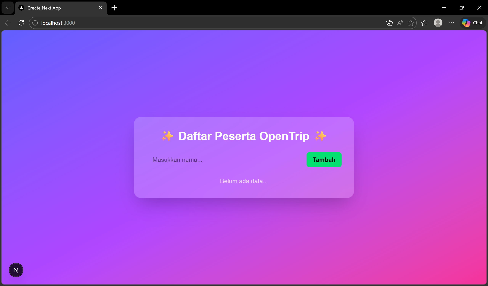
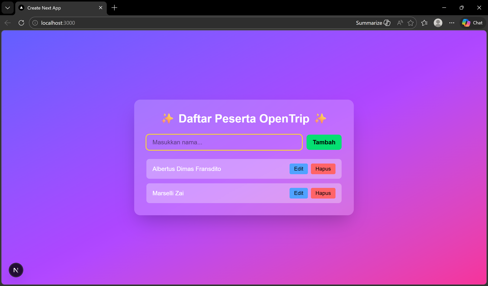
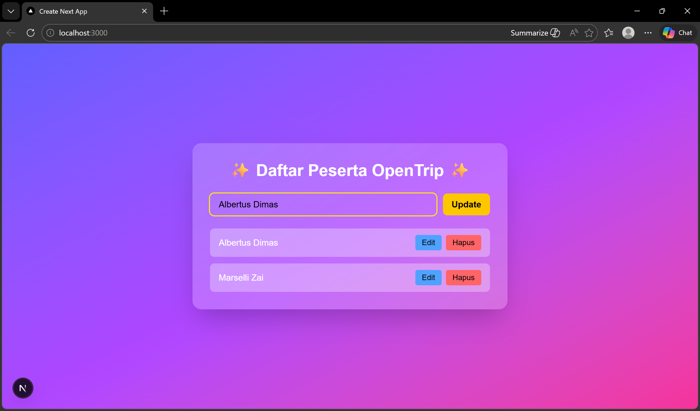
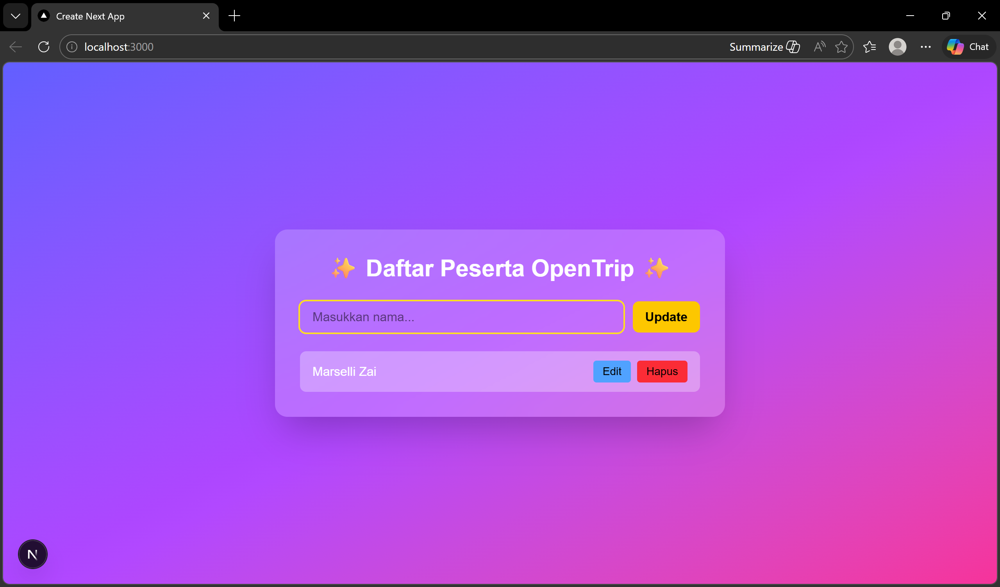

## Hasil Tampilan
Berikut adalah hasil implementasi:

Program ini merupakan aplikasi Form CRUD sederhana menggunakan Next.js dengan TypeScript. Aplikasi berjalan di sisi client dengan menambahkan `"use client"` dan menggunakan React Hook `useState` untuk mengelola data.

Fitur yang tersedia meliputi:

1. Tambah data (Create)
   User memasukkan nama ke dalam input, lalu saat form disubmit, data akan ditambahkan ke dalam state `data` dan ditampilkan dalam daftar.

2. Tampilkan data (Read)
   Data yang tersimpan dalam state ditampilkan menggunakan metode `map()` sehingga setiap perubahan state langsung memperbarui tampilan.

3. Edit data (Update)
   Ketika tombol Edit ditekan, data yang dipilih dimasukkan kembali ke input dan index-nya disimpan dalam `editIndex`. Setelah disubmit, data lama akan diperbarui.

4. Hapus data (Delete)
   Tombol Hapus akan menghapus data berdasarkan index menggunakan method `filter()`, kemudian state diperbarui sehingga tampilan berubah secara otomatis.

Secara keseluruhan, program ini menerapkan konsep state management, event handling (`onChange`, `onSubmit`, `onClick`), conditional rendering, dan rendering list dinamis dalam Next.js.
